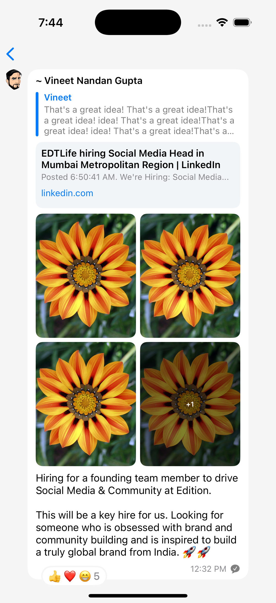

# Rich Chat Bubble UI (UIKit)

A custom **UIKit** implementation of a rich chat bubble that embeds social media-style post content — including quotes, previews, images, and reactions — all styled inside a chat interface.

Inspired by platforms like **LinkedIn within iMessage/WhatsApp**, this UI is ideal for showcasing professional or branded posts shared inside chat apps.
This project is a customizable, rich media **chat bubble UI** built in **UIKit**, showcasing advanced components like:

## ✨ Features

- **Rich Chat Bubble UI**: Clean, rounded chat bubble layout with user avatar, name, and styled quote.
- **Reply Preview Block**: Inline reply with vertical highlight and quoted text layout.
- **Social Link Card**: Social media-style link preview with title, subtitle, and tappable source link.
- **Dynamic Image Grid**: Adaptive media grid layout (1–4 images) with “+X” overlay for overflow.
- **Emoji Reactions Pill**: Horizontally stacked emoji reactions with a count indicator (👍 ❤️ 😁).
- **Timestamp & Status**: Time label and delivery status icon aligned within the bubble.
- **Media Viewer**: Tap-to-expand full-screen media viewer with caption and sender info.
- **Lottie Animation Ready**: Placeholder included for future animated stickers or media.
- **UIKit + SwiftUI**: Built entirely with UIKit, previewed using SwiftUI via `UIViewRepresentable`.
- **Reusable Component**: Modular design ideal for integrating WhatsApp/Telegram-style chat apps.
- **Auto Layout**: Responsive and flexible design using programmatic constraints (no Storyboards).

## 📱 Screenshot

## 🛠️ Technologies

- UIKit
- Auto Layout (programmatic)
- SwiftUI (for previews)
- Lottie (optional animation support)
- Custom views using `UIView`, `UILabel`, `UIImageView`, `UIStackView`
- Optional: `UICollectionView` for image grid
- Emoji reactions as horizontally stacked buttons or labels

## 📦 Requirements

- iOS 13.0+
- Xcode 14+
- Swift 5

## 🧩 Potential Use Cases

- WhatsApp-style in-chat content sharing
- LinkedIn-like job post previews in messaging apps
- Brand and marketing card sharing inside chat-based platforms
- Rich previews in messaging apps
- In-app sharing of job posts, blogs, or announcements
- Embedded social cards within chat bubbles

## 🔧 Setup

1. Clone the repo
2. Open in Xcode
3. Run on the simulator or device
4. Add `img1.png` and `demo_avatar.png` in your Assets
5. Customize the `PostBubbleView` or `ChatBubbleCell` as needed
6. Run the app using SwiftUI’s `ChatBubbleViewDisplay` preview or push `ChatBubbleView` in your chat screen

## 🧠 Customization Ideas

- [ ] Add dark mode support
- [ ] Support Lottie animation integration
- [ ] Make reaction tap interactive
- [ ] Convert to `UICollectionViewCell` for use in message lists
- Add video preview support
- Convert to SwiftUI
- Make it reusable in chat SDKs (e.g., MessageKit, Stream Chat)

## 📄 License

MIT License
